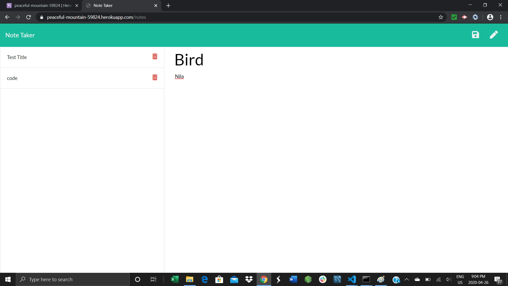
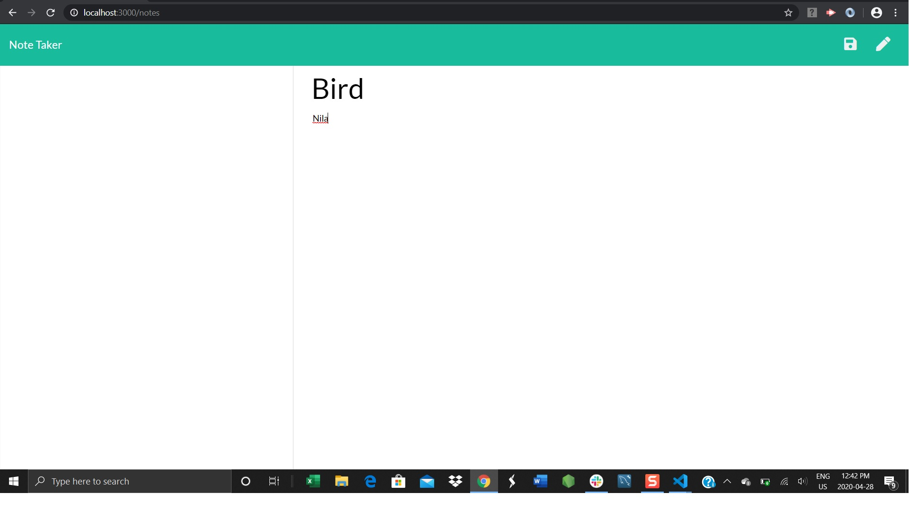
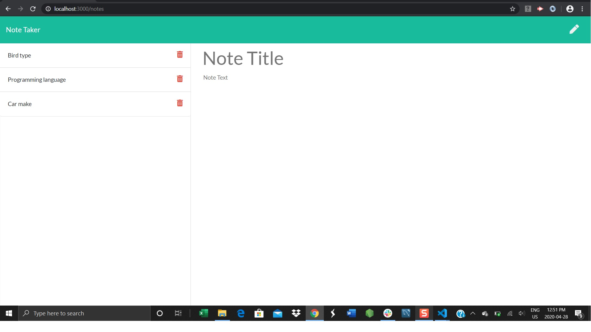

 # Project Title:

  ## *Note Taker*
----

  # Project description:
  ### This section describe the project detail.

  ### This note taker application use to create a notes with detail, once the details are entered a save button appeared to save the notes. User also can delete the notes using the delete button. Application creates a localhost web server dynamically and perform the http operations such as GET, POST and DELETE operations based on the user activity in the application.
  ### This application deployed in Heroku
  ### This application uses HTML,Javascript,Node.js and Heroku.

 --- 

  # Image 
  # 
  This is notes page in this we can write note title and note txt to save the text by clicking save button on the top right.
  # 
  After saved the text it will save and displayed in left side .
  # 
we can delete the saved note by clicking trash can .

  ## Link:https://peaceful-mountain-59824.herokuapp.com/